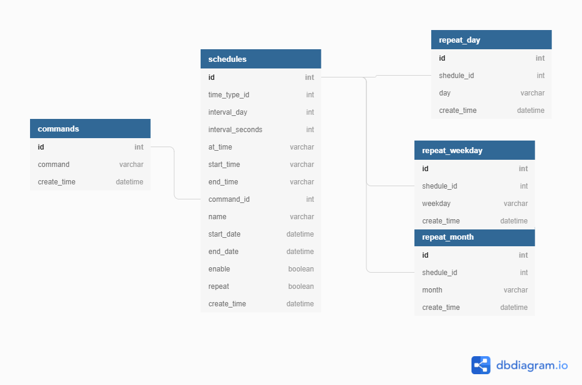

# scheduler-CRUD

> 1. 利用dbdiagram.io建立table關聯圖與create語法(script/schema.sql)
>
> 2. 在mysql建立table
>
> 3. 編輯script/query.sql, 用sqlc產生CRUD function
> 
> 4. 編輯DB Transaction
> 
> 5. 以gin開發REST API
> 
> 6. 起grpc server, 只加入get_one_schedule & all_commands
>



sqlc命令
```shell
sqlc generate
```
grpc, 在第一層目錄下執行
```shell
protoc -I=. --go_out=plugins=grpc:pkg/pb proto/*.proto
```
docker 
```shell
docker build -t thomaswei/schedule-crud . --no-cache
# 加入環境變量從container訪問host db
docker run -d --name schedule-crud -p 9567:9567 -p 55555:55555 -e DB_HOST=host.docker.internal thomaswei/schedule-crud 
```


